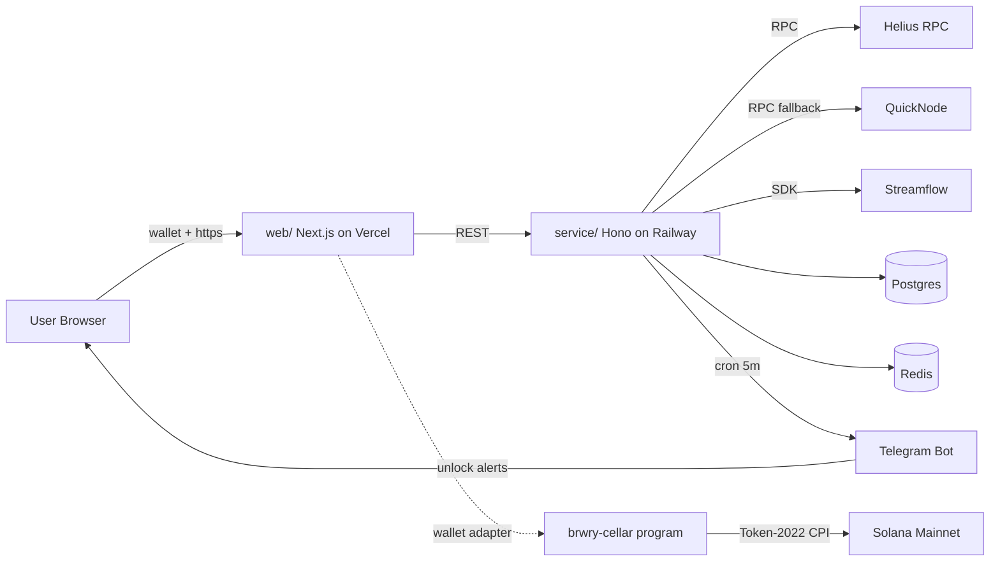

<p align="center">
  
</p>

<h1 align="center">Brwry</h1>

<p align="center">
  <em>Aged on-chain. Released by time.</em>
</p>

<p align="center">
  <a href="https://x.com/brwryfun"></a>
  <a href="https://brwry.fun"></a>
  <a href="https://brwry.fun/docs"></a>
  <a href="./LICENSE"></a>
  
</p>

<p align="center">
  
  
  
</p>

<p align="center">
  
  
  
</p>

---

Brwry is a vintage-brewery take on Solana token vesting. Rather than a flat linear release that ignores how tokens actually age in the market, Brwry lets teams shape unlock curves the same way a master cellarman shapes a whisky: slow at first, a sudden pour midway, a long amber tail, a cliff. Five presets ship in the box; any curve you can draw at a keyboard can be compiled, deployed, and claimed.

The name is pronounced like **brewery**, with the vowels clipped. The ticker is `$BRWRY`.

## Philosophy

Token unlocks are usually a single number on a calendar and a graph that looks like a staircase. That is fine for payroll. It is less fine for the real reason vesting exists, which is to let conviction settle: founders waiting out a cycle, advisors who want the project to survive their lockup, treasuries that would rather not dump into thin books. Those are **curves**, not steps.

Brwry treats a vesting stream the way a cellar treats a cask. There is a start date. There is a long middle where nothing seems to happen. There is a finish, and it never tastes the same twice. The job of the tool is to make the middle legible, the finish predictable, and the cellar beautiful enough that people actually want to look.

## Features

| Capability | Notes |
| --- | --- |
| Five unlock curves | Linear, cliff, exponential, logarithmic, s-curve |
| Curve designer | Drag-and-drop control points, JSON export |
| Streamflow integration | Deploy vesting contracts without leaving the app |
| Token-2022 support | Transfer fee extension, interest-bearing mints, permanent delegate |
| Cask visualizer | Three.js scene that renders every active stream as a labelled barrel |
| Telegram whispers | Opt-in alerts when an unlock is within 24h, 1h, or live |
| Batch streams | Airdrop a cohort under a shared curve with one signature |
| Multisig-friendly | Every claim step is a standard `VersionedTransaction` |

## Architecture



The repository here is a small, readable slice of that system: a Rust workspace that ships the shared curve math as a `no_std` crate and a tiny Anchor program around it, curve math in Python for plotting and sanity-checking, a sketch of the Streamflow call pattern in TypeScript, and the prose that explains when you would reach for each curve.

## Installation

```bash
git clone https://github.com/brwryfun/brwry.git
cd brwry
```

Python demos (curve plotting):

```bash
python -m venv .venv
source .venv/bin/activate    # Windows: .venv\Scripts\activate
pip install numpy matplotlib
python src/curve_designer.py
python src/cask_visualizer.py
```

TypeScript sketch (vesting call pattern):

```bash
npm install --save @solana/web3.js @streamflow/stream
npx ts-node src/example_vesting.ts
```

The TypeScript example does not sign or broadcast. It builds a stream config, prints the parameters Streamflow expects, and returns. Real deployment happens from the web client with a connected wallet.

Rust curve crate (shared with the on-chain program):

```bash
cargo check -p brwry-curves
cargo test -p brwry-curves
cargo run --bin cask_cli -- --curve s-curve --total 1000000 --start 0 --end 31536000 --periods 12
```

The Anchor program under `programs/brwry-cellar` uses the curves crate with `default-features = false` so it builds clean to BPF. A placeholder program id ships in `Anchor.toml`; replace it with the id your toolchain prints before deploying.

## Unlock curves at a glance

| Curve | Shape | When to use |
| --- | --- | --- |
| Linear | Straight line from zero to full | Payroll, simple team vests |
| Cliff | Flat then linear after the cliff | Advisors with a probation period |
| Exponential | Slow start, steep finish | Long-term treasury reveal |
| Logarithmic | Fast start, long tail | Liquidity bootstrapping, airdrops |
| S-curve | Slow, fast, slow | Balanced founder grants, ecosystem funds |

The math for each curve lives in `docs/curves.md`. The same formulas are implemented identically on-chain, in the service layer, and in the Python demos here, so a curve you draw in the designer renders the same everywhere.

## Usage

The shortest possible path:

1. Pick a curve in the designer at `brwry.fun/visualizer`.
2. Drop control points until the cellar shape matches your intent.
3. Export JSON.
4. Paste into the vesting form at `brwry.fun/vest`, sign with Phantom or Solflare.
5. Turn on Telegram whispers if you want to hear from the cellar.

Or, to just look at a curve locally:

```bash
python src/curve_designer.py --preset s-curve --months 18
```

That writes an SVG to the working directory and prints the discrete cliff table that Streamflow will receive.

## Repository layout

```
.
|-- assets/                    banner and logo for the README
|-- programs/
|   |-- brwry-curves/          no_std fixed-point curve math + cask_cli
|   |   |-- src/lib.rs         five presets in u128 arithmetic
|   |   |-- src/schedule.rs    sample_curve + sample_schedule
|   |   |-- src/bin/cask_cli.rs prints a release table to stdout
|   |   `-- tests/curves.rs    boundary tests for every preset
|   `-- brwry-cellar/          Anchor 0.29 program around the curves crate
|       |-- src/lib.rs         program entry, instruction dispatchers
|       |-- src/state.rs       Cask + Schedule PDAs
|       |-- src/errors.rs      BrwryError enum
|       `-- src/instructions/  create_cask + release_barrel
|-- src/
|   |-- curve_designer.py      five reference curves, matplotlib plots
|   |-- cask_visualizer.py     ascii + matplotlib view of an aging cask
|   `-- example_vesting.ts     Streamflow call pattern sketch
|-- docs/
|   |-- curves.md              formulas and when to use them
|   |-- rust.md                brwry-curves usage and fixed-point conventions
|   |-- anchor.md              brwry-cellar PDAs, instructions, CPI surface
|   `-- quickstart.md          opinionated five-minute walkthrough
|-- Cargo.toml                 workspace manifest
|-- Anchor.toml                anchor workspace, placeholder program id
|-- LICENSE
`-- README.md
```

Production code (the full web, service, watcher, and designer) lives outside this repository. The pieces here are the ones that benefit from being public: math, prose, and a couple of sketches.

## Contributing

Issues are welcome. Pull requests are read, but low-noise ones land faster than sweeping ones. If you are adding a curve, please include the closed-form formula in `docs/curves.md` and a plot in `src/`.

## License

MIT. See `LICENSE`.
